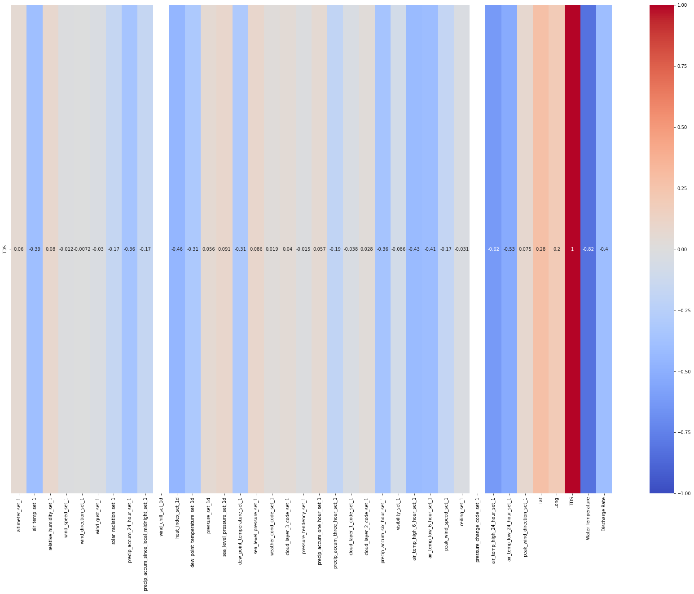
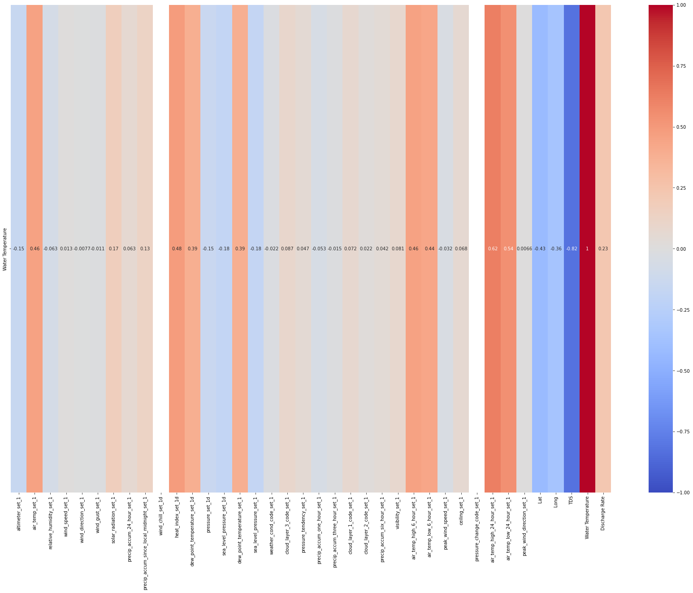
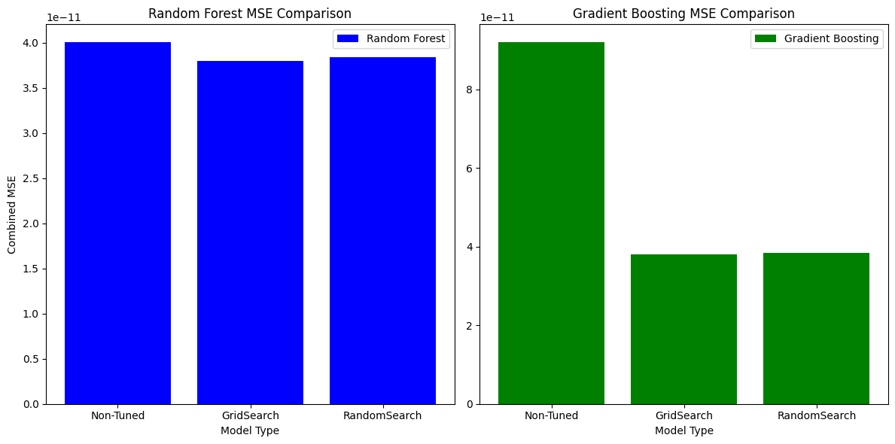

# SUBMISSION FORMAT FOR THE REPORTS

# Weather Data to Predict TDS, Water Temparture, and Water Quality

**Garrett DiPalma, Nilu Sah, Isaiah Gage**
## Contribution
- My contribution involved writing and coding the python notebook. I wrote the RF, DT, and FNN models. I also wrote the hyperparameter methods GridSearchCV and RandomSearchCV. I worked on scaling and normalizing the data after the graphs showed data preprocessing errors. I had to also write custom functions to fix outliers in dataset and fix timezone issues. My parts in the report is the graphs and tables
## Project Summary

Our goal with this project is to predict given certain time, weather, and lat/lon values (or cluster) what is the predicted TDS(Total Dissolved Solids) and Water Temperature the lake.

## Problem Statement

The problem we are solving is if the TDS sensors, when it's turned back on, has issues, or futher down spring lake there are not that many markers however TDS and Water Temperature vary alot downstream. The idea is that if we have weather data, given certain location markers on the lake what is the predicted TDS and Water Temperature.

** Give a clear and complete statement of the problem.**: Predicting TDS and Water Temperature in Spring Lake Using Weather Data potential for issues with TDS sensors and the scarcity of location markers downstream.

** What is the benchmark you are using. Why? **: The benchmark we are using are R^2(R-Squared) and MSE(Mean Squared Error) which helps to evaluate regression model. While R-squared provides an overall measure of model goodness-of-fit, MSE provides a more detailed view of the magnitude of prediction errors. we are also going to use Common metrics like accuracy, precision, recall, F1 score, and mean average precision (mAP) serve as benchmarks to evaluate the effectiveness of models.

** Where does the data come from, what are its characteristics? Include informal success measures (e.g. accuracy on cross-validated data, without specifying ROC or precision/recall etc) that you planned to use.**: The TDS raw data which is a TDS sensor came from the physical device. we are also using the two weather datasets i.e. G3425 and KHYI as well as the data from San Marcos Airport. We are combining all these datasets together.

Characteristics for Dataset1 (Meteorological Data):

    Temporal Data: The Date_Time column indicates that this dataset is time-series data.
    Mixed Data Types: Includes numerical (continuous and discrete) and categorical data (like wind_cardinal_direction_set_1d).
    Weather and Climate Focus: Data is centered around weather and atmospheric conditions.

Characteristics for Dataset2 (Environmental Data):

    Geospatial and Temporal Data: Includes both location (latitude and longitude) and time (Taken At, Date) information.
    Environmental Focus: Concentrates on water quality parameters like TDS and temperature.
    Structured Time-Series Data: Data is organized in a time-series format with additional geospatial context.

Characteristics for Dataset3 (Extended Meteorological Data):  
 Characteristics:

    Comprehensive Meteorological Data: Provides a more detailed view of weather conditions compared to Dataset 1.
    High Granularity: Includes more specific and potentially high-frequency measurements (like one-hour precipitation accumulation).
    Aviation-Specific Data: Contains METAR data, useful for applications in aviation and detailed weather analysis.

Characteristics for Dataset4:

    Hydrological Focus: The dataset is centered around water-related measurements, particularly streamflow, which is a key parameter in hydrology and water resource management.
    High Temporal Resolution: The data is recorded at 15-minute intervals, providing a detailed time series of the measured parameter.
    Standardized Format: The use of agency codes, site numbers, and specific measurement codes suggests a standardized data collection protocol, likely for consistency across various sites and times.
    Quality Indicators: The presence of a quality code (141565_00060_cd) with each measurement suggests that the data includes metadata about its reliability or processing status.
    Time Zone Awareness: Including the time zone in which the data was recorded (tz_cd) is crucial for accurate temporal analysis, especially if integrating this data with other datasets collected in different time zones.

We used 10 fold cross-validation with randomforestregressor to significantly reduce overfitting.

We are hoping to achieve to predict TDS value and water temperature based on weather temperature.

## Dataset

There are 4 datasets I'm using, two weather datasets (G3425 (4103 _ 17) and KHYI (114389 _ 43) Stations), a TDS dataset (36831 _ 9) and . There will need to be some extrapolation of the data to match it into one large dataframe. One, any missing data from G3425 needs to be filled in with KHYI data. The timestamps need to be from (06/11/22 - 06/11/23) for all datasets need to be 1 second intervals. Once the data is correctly aligned with the TDS data, they will be combined into one dataframe. Timestamp will be dropped. The Final_Dataset shape with extrapolation is (31536001 _ 67).

Dataset 1: Meteorological Data

Columns:

    Station_ID: Identifier for the weather station.
    Date_Time: Date and time of the observation.
    altimeter_set_1: Altimeter settings (in inches of mercury, INHG).
    air_temp_set_1: Air temperature (in Fahrenheit).
    relative_humidity_set_1: Relative humidity (in percentage).
    wind_speed_set_1: Wind speed (in miles per hour).
    wind_direction_set_1: Wind direction (in degrees).
    wind_gust_set_1: Wind gust (in miles per hour).
    solar_radiation_set_1: Solar radiation (in W/m²).
    precip_accum_24_hour_set_1: 24-hour precipitation accumulation (in inches).
    precip_accum_since_local_midnight_set_1: Precipitation accumulation since local midnight (in inches).
    wind_chill_set_1d: Wind chill (in Fahrenheit).
    wind_cardinal_direction_set_1d: Wind cardinal direction.
    heat_index_set_1d: Heat index (in Fahrenheit).
    dew_point_temperature_set_1d: Dew point temperature (in Fahrenheit).
    pressure_set_1d: Atmospheric pressure (in INHG).
    sea_level_pressure_set_1d: Sea level pressure (in INHG).

Dataset 2: Environmental Data

Columns:

    Lat: Latitude of the observation location.
    Long: Longitude of the observation location.
    TDS: Total Dissolved Solids (presumably in mg/L or similar unit).
    Temperature: Water temperature (presumably in Fahrenheit).
    Taken At: Date and time when the measurement was taken.
    Month, Day, Year: Date components of the Taken At field.
    Date: Date of the observation.

Dataset 3: Extended Meteorological Data

Columns:

    Similar to Dataset 1, but with additional fields like visibility_set_1, weather_cond_code_set_1, cloud_layer_3_code_set_1, precip_accum_one_hour_set_1, etc.
    Includes METAR data, which is a format for reporting weather information, primarily used in aviation.

Dataset 4:

Columns:

    agency_cd: Agency code, which in this case is 'USGS' for the United States Geological Survey.
    site_no: Site number, which identifies the specific location or station where the data was collected.
    datetime: The date and time of the observation.
    tz_cd: Time zone code, indicating the time zone for the datetime (e.g., CDT for Central Daylight Time).
    141565_00060: This appears to be a specific measurement or observation code. The number '00060' typically represents streamflow in cubic feet per second (cfs) in USGS datasets.
    141565_00060_cd: A code associated with the 141565_00060 measurement, often indicating the quality or status of the data (e.g., 'A' might stand for approved data).

Final Dimensions of dataset: (2102401, 48)

General Observations Across Datasets:

    High Dimensionality: All datasets have a wide range of variables, which might require dimensionality reduction techniques for analysis or modeling.
    Potential for Complex Relationships: Given the nature of weather and environmental data, there may be complex interactions between variables.
    Data Preprocessing Needs: The presence of different units (like Fahrenheit, INHG, etc.) and mixed data types suggests a need for careful preprocessing.

These datasets are rich in information and could support a variety of analyses or modeling tasks, particularly in the domains of meteorology, environmental science, and geospatial analysis.

**If you are using benchmarks, describe the data in details. If you are collecting data, describe why, how,**:

The benchmarks employed for assessing our models include R^2 (R-squared) and Mean Squared Error (MSE). In the context of our dataset, denoted as final\*df, and considering the implementation of both RandomForestRegressor and DecisionTreeRegressor, the following details characterize the data:

- 'TDS' and 'Water Temperature', are excluded from the list of features to prevent them from being used as predictors. These variables will be treated as the target variables for regression analysis.
- String columns in the dataset are encoded using the LabelEncoder. The dataset is divided into training and testing sets using the train_test_split function, with 70% of the data allocated to training and 30% to testing. This ensures a robust evaluation of the model's generalization performance.

RandomForestRegressor:
Performance Evaluation - MSE and R^2 Score:
Mean Squared Error (MSE) is computed for both 'TDS' and 'Water Temperature' on the test set. Additionally, R^2 Scores are calculated for both outputs. The MSE for 'TDS' is 5.696117261977822, and for 'Water Temperature' is 0.04212494134879333. The R^2 Score for 'TDS' is 0.9975356271504586, and for 'Water Temperature' is 0.9937009853989969.

DecisionTreeRegressor:
Before training the DecisionTreeRegressor, the numerical features are standardized using StandardScaler to ensure uniformity in scale.
Performance Evaluation - MSE and R^2 Score:
Mean Squared Error (MSE) is computed for both 'TDS' and 'Water Temperature' on the test set. R^2 Scores are also calculated for both outputs. The MSE for 'TDS' with the DecisionTreeRegressor is 15.169522521127822, and for 'Water Temperature' is 0.13272714302797894. The R^2 Score for 'TDS' is 0.993437045320132, and for 'Water Temperature' is 0.9801530830640167.
<Expand and complete for Project Submission>

#What Processing Tools have you used. Why? 
    We have used following processings tools:
1) Pandas:
In this project, Pandas played a pivotal role in managing and processing our data. We leveraged its robust DataFrame structures to organize and manipulate our data efficiently. This was particularly crucial given the complex nature of our dataset, which included time-series data and required precise handling of dates and times.

Key functions from Pandas, such as pd.to_datetime and pd.date_range, were instrumental in our workflow. We used pd.to_datetime to convert string representations of dates and times into Python datetime objects. This conversion was essential for enabling accurate time-based analyses and manipulations. The pd.date_range function allowed us to create a comprehensive range of datetime values, which was vital for aligning and standardizing our time-series data across multiple datasets.
    
2) NumPy:In our project, NumPy played a critical role in handling numerical computations and data transformations. This library, known for its efficient handling of arrays and matrices, was particularly useful in scenarios where we needed to perform complex mathematical operations on our data.

A specific application of NumPy in our project was in the creation and manipulation of the dividing line for clustering our data. We used NumPy arrays to define the coordinates of this line, which then served as a basis for segmenting our dataset into 'Upstream' and 'Downstream' clusters. This segmentation was based on the latitude values, with the NumPy np.where function enabling us to classify each data point efficiently. This classification was essential for subsequent analyses that required a clear distinction between these two categories.

3) Seaborn:In this project, Seaborn served as a vital tool for data visualization, enabling us to represent our complex data sets in a more accessible and insightful manner. This Python visualization library, known for its aesthetically pleasing and informative statistical graphics, was instrumental in uncovering underlying patterns and relationships within our data.

We utilized Seaborn's advanced plotting capabilities for various types of visualizations, with a particular emphasis on heatmaps. These heatmaps allowed us to visually represent the intensity and distribution of different variables across our datasets. By converting numerical values into a color spectrum, we could easily identify trends, anomalies, and correlations, which might not be immediately apparent from the raw data.

4)Timezone Handling (pytz):In our project, the pytz library was integral for managing and converting timezones in our datetime data. Given the global nature of our data, which encompassed different time zones, accurate timezone handling was crucial for ensuring the consistency and reliability of our time-series analyses.

We specifically used pytz to standardize all datetime objects to UTC (Coordinated Universal Time), which served as a uniform reference point. This standardization was essential in scenarios where we were comparing or aggregating data from different geographical locations. For example, entries with 'CDT' (Central Daylight Time) were converted to UTC using pytz's timezone conversion functions. This allowed us to accurately align and compare events or trends occurring in different time zones.
    
5) Custom Functions for Data Parsing and Clustering: In our project, the creation and utilization of custom Python functions were pivotal in addressing specific data processing challenges unique to our dataset. These bespoke functions enabled us to tailor our data manipulation and analysis precisely to our needs, ensuring both efficiency and accuracy.
One such custom function was remove_timezone, designed to strip timezone information from datetime strings. This function was essential for standardizing datetime formats across different datasets, facilitating easier manipulation and comparison of timestamp data.
Another significant custom function we developed was parse_datetime. This function was adeptly crafted to handle various datetime formats and timezones encountered in our data. It proved invaluable in scenarios where we needed to parse datetime strings with different formats and convert them to standardized Python datetime objects. Special handling for timezones, such as 'CDT' and 'UTC', within this function, allowed us to accurately localize and convert these times, which was critical for our time-based analysis. It also helps to classify data into 'Upstream' and 'Downstream' based on latitude.
    In Conclusion, these tools we have chosen are best for efficiency, flexibility, and suitability for handling, processing, and visualizing large datasets, particularly when working with our data types like dates and times. 

##Exploratory Data Analysis

For the Exploratory Data Analysis (EDA), the following graphs were used:

- **Heatmaps**: Utilized to visualize the correlation between 'TDS' (Total Dissolved Solids), 'Water Temperature', and other features in the dataset. This helps in identifying which features are most strongly related to our target variables.
- **Scatter Plots**: Employed to examine the relationships between 'TDS', 'Water Temperature', and other features. The goal was to identify the amount of noise in the dataset and to extrapolation is (31536001 \* 67).
- In analyzing the data represented in the graphs, a notable micro trend emerges when comparing Total Dissolved Solids (TDS) levels to precipitation and wind metrics. Specifically, there appears to be a negative correlation between TDS and both water temperature and precipitation. This suggests that as precipitation increases, or as water temperature rises, the concentration of dissolved solids in the water tends to decrease. This trend could be indicative of dilution effects, where increased rainfall or higher temperatures lead to greater water volumes, thereby diluting the concentration of dissolved substances. Similarly, the relationship with wind could be explained by increased surface agitation and aeration in windy conditions, potentially affecting the solubility or distribution of these solids.
    

    

    

    

    

**Prediction Graphs**
    
-These are all 5 models running through the entire columns to find out which models are more robust and would fit better in our dataset
    

    

The use of these graphs provided valuable insights into the underlying structure and relationships within the data, guiding subsequent preprocessing and modeling steps.

## Data Preprocessing

During the data preprocessing phase, the following steps were considered and implemented:

- **Min/Max Scailing**: After observing a significant amount of noise in the dataset through scatter plots, we employed Min/Max Scaling. This scaling approach is particularly useful for our regression models as it normalizes the features by transforming them to a specific range (between 0 and 1). This ensures that all of our features contribute equally to our model's performance, enhancing its ability to make accurate predictions.
    
- **Normalization**:
In addition to Min/Max Scaling, we performed normalization by the mean and standard deviation after identifying substantial noise in the dataset through scatter plots. This method is was especially valuable for regression models as it standardizes the features by removing the mean and scaling to unit variance, ensuring that all features contribute equally to the model's performance. The combination of Min/Max Scaling and normalization by the mean and standard deviation enhances the robustness of the model and promotes accurate predictions.

    - **Prediction Graphs after Scaling and Normalization**
        - Random Forest
            
    
        - Decision Tree
            

        - Gradient Boosting
            
    
- **Dimensionality Reduction**: Although considered, dimensionality reduction techniques like PCA (Principal Component Analysis) were not used. This decision was based on the need to maintain interpretability of the features, as PCA transforms original variables into a set of linearly uncorrelated components which can be less interpretable. Moreover, the RandomForest model used in this project can inherently handle high-dimensional data effectively, reducing the need for explicit dimensionality reduction.

 # Here are the steps on how we processed our data
    
#### 1. Initial Mean Imputation:
- We initially iterates over each column in the DataFrame (final_df).
- For each numeric column, we calculate the mean (col_mean) excluding NaN values.
- We then identify the first and last indices of NaN values in the column (first_nan_index and last_nan_index).
- If NaN values exist in the column, we fill the first occurrence of NaN with the mean (col_mean) and the last occurrence of NaN with the mean.
    
#### 2. Linear Interpolation for Numeric Columns:
- After the mean imputation, we apply linear interpolation to numeric columns using final_df.interpolate().
- Linear interpolation estimates missing values based on the linear trend between known values. It helps in maintaining the overall trend of the data.
    
#### 3. Forward Fill for Non-Numeric Columns:
- We identify the non-numeric columns in the DataFrame (non_numeric_columns).
- Forward filling (method='ffill') is then applied to these non-numeric columns. This means that missing values are filled with the most recent non-missing value in the column.
    
#### 4.Backward Fill for Non-Numeric Columns:
- Backward filling (method='bfill') is applied to the same non-numeric columns. This means that if there are still missing values after forward filling, they are filled with the next non-missing value in the column.
- We did MinMax Scaling and Normalization
#### 5.Result Checking:
- Finally, we check the resulting DataFrame (final_df.head()) to verify whether NaN values were handled appropriately.
    
In summary, these steps we did here form a comprehensive strategy for handling missing values in our DataFrame. The mean imputation addresses initial NaN values in numeric columns, linear interpolation aids in maintaining the trend for numeric columns, and forward/backward filling ensures continuity in non-numeric columns.

## Machine Learning Approaches

### Baseline Evaluation Setup
The baseline model chosen for this project is the **Decision Tree Regressor**. This model serves as the initial benchmark for evaluating more complex models later. The decision to use a Decision Tree as a baseline stems from its simplicity and interpretability. It provides a straightforward understanding of how input features affect the output and is easy to visualize and explain. 

### Machine Learning Methods Consideration
- **Random Forest Regressor**: Selected for its ability to handle non-linear data and robustness against overfitting, which is crucial given the complexity and noise in the dataset. Random Forest, part of the ensemble methods family, combines multiple decision trees to improve accuracy and control overfitting.

- **Gradient Boosting Regressor**: Considered for its effectiveness in improving model performance by sequentially adding weak learners to correct errors made by previous models. It falls under the category of boosting algorithms in ensemble methods, known for their predictive power and efficiency.

### Method/Dataset Description
The machine learning methodology adopted for this project involved multiple stages of data preprocessing and feature selection, leading to a refined approach for modeling. The key stages are as follows:

1. Unscaled Data: The project began with the use of the entire dataset in its raw form. This initial stage involved working with all available features, which provided a fundamental understanding of the data's distribution and potential patterns. The purpose of starting with unscaled data was to establish a baseline for future comparisons and to understand the raw data's impact on the models.

2. Feature Selection - Two Approaches:

 - Top 10 Correlated Features: The first approach to feature selection involved identifying and using the top 10 features that had the highest correlation with the target variables. This method aimed to focus the models on the most influential features, potentially enhancing accuracy while reducing complexity.
 - Weather-Related Features: The second approach concentrated solely on weather-related features. This decision was based on the hypothesis that weather conditions significantly impact the target variables, and focusing on these features could yield more insightful results.
3. Refined Feature Selection: After experimenting with the top 10 correlated features and weather-related features, the decision was made to drop the top 10 features. The focus was shifted entirely to weather-related features, as they were deemed more relevant to the study's objectives. This step marked a significant refinement in the modeling strategy, prioritizing domain-specific features over statistical correlations.
4. Data Normalization and Scaling:
 - MinMax Scaling: To ensure that all features contributed equally to the model's performance, MinMax scaling was applied. This scaling technique adjusts the data such that it fits within a given range, typically 0 to 1, thereby normalizing the scale of different features.
 - Normalization: Alongside MinMax scaling, the data were also subjected to normalization processes. This step was crucial in handling outliers and reducing skewness in the data distribution, leading to more robust and reliable models.

### Justification for ML Tools Selection
- **Scikit-learn's RandomForestRegressor and GradientBoostingRegressor**: These were chosen for their efficiency, flexibility, and strong community support. They provided insights into feature importance and allowed fine-tuning through hyperparameter optimization.

- **GridSearchCV and RandomizedSearchCV**: Utilized for hyperparameter tuning to optimize model performance. These tools helped identify the best parameters, guiding the choice of models for final predictions.

### Models Inclusion
1. **Baseline Model - Decision Tree Regressor**: Provides an initial performance benchmark.
2. **Improved Models**:
   - **Random Forest Regressor**: An ensemble model that improved accuracy and generalizability compared to the baseline.
   - **Gradient Boosting Regressor**: Offered further improvements in prediction accuracy by sequentially correcting errors.

## Experiments

- **Model Training and Evaluation**: Both the Decision Tree Regressor (baseline model) and the Random Forest Regressor were trained on the dataset. Their performance was evaluated using metrics such as Mean Squared Error (MSE) and R-squared (R²). (We used also MAE and RMSE).
- **Gradient Boosting vs Decision Tree**

| Model              | Target Variable     | MSE    | RMSE  | MAE   | R^2   |
|--------------------|---------------------|--------|-------|-------|-------|
| Decision Tree      | TDS                 | 19.97  | 4.47  | 0.83  | 0.99  |
| Decision Tree      | Water Temperature   | 0.13   | 0.35  | 0.13  | 0.98  |
| Gradient Boosting  | TDS                 | 29.57  | 5.44  | 2.40  | 0.99  |
| Gradient Boosting  | Water Temperature   | 0.20   | 0.45  | 0.30  | 0.97  |

- **RandomForest vs Decision Tree**

| Model              | Target Variable     | MSE                  | RMSE               | MAE                | R^2                |
|--------------------|---------------------|----------------------|--------------------|--------------------|--------------------|
| Decision Tree      | TDS                 | 19.77    | 4.44 | 0.96 | 0.99 |
| Decision Tree      | Water Temperature   | 0.25  | 0.50 | 0.15| 0.96 |
| Random Forest      | TDS                 | 5.78 | 2.40 | 0.74 | 0.99 |
| Random Forest      | Water Temperature   | 0.055 | 0.23| 0.10 | 0.99 |

- **Results**
    - TDS

    | Model | MSE | RMSE | MAE | R^2 | 
    |-------|-----|------|-----|-----|
    | Decision Tree | 13.86 | 3.72 | 0.82 | 0.99  |
    | Random Forest | 6.87 | 2.62 | 0.69 | 0.99 |
    | Gradient Boosting | 16.79 | 4.09 | 0.82 | 0.99 |
    | FNN | 409.41 | 20.23 | 12.07 | 0.84 |
    | SVR | 2869.27 | 53.57 | 22.54 | -0.11  |

    - Water Temperature

    | Model | MSE | RMSE | MAE | R^2 | 
    |-------|-----|------|-----|-----|
    | Decision Tree | 0.10 | 0.32 | 0.12 | 0.98  |
    | Random Forest | 0.05 | 0.22 | 0.10 | 0.99  |
    | Gradient Boosting | 0.19 | 0.44 | 0.12 | 0.97 |
    | FNN | 32.35 | 5.69 | 4.97 | -3.51 |
    | SVR | 7.45 | 2.72 | 1.15 | 0.04  |

   - (??) Present error analysis and suggestions for future improvement. (??)
        #### Total Dissolved Solids (TDS)
            Decision Tree:
                Good: Low errors (MSE: 13.86, RMSE: 3.72).
                Improve: Watch for overfitting; consider using ensemble methods.
        
            Random Forest:
                Impressive: Few errors (MSE: 6.87, RMSE: 2.62).
                Improve: Check feature importance; fine-tune.
        
            Gradient Boosting:
                Decent: Some errors (MSE: 16.79, RMSE: 4.09).
                Improve: Search more hyperparameters.
        
            FNN:
                Challenging: Higher errors (MSE: 409.41, RMSE: 20.23).
                Improve: Try complex networks; revisit features.
        
            SVR:
                Struggling: Significant errors (MSE: 2869.27, RMSE: 53.57).
                Improve: Rethink SVR; explore other methods.
        
        #### Water Temperature
            Decision Tree:
                Excellent: Very low errors (MSE: 0.10, RMSE: 0.32).
                Improve: Watch for overfitting.
        
            Random Forest:
                Outstanding: Minimal errors (MSE: 0.05, RMSE: 0.22).
                Improve: Check feature importance.
        
            Gradient Boosting:
                Good: Few errors (MSE: 0.19, RMSE: 0.44).
                Improve: Search more hyperparameters.
        
            FNN:
                Challenging: Higher errors (MSE: 32.35, RMSE: 5.69).
                Improve: Try complex networks.
        
            SVR:
                Moderate errors: (MSE: 7.45, RMSE: 2.72).
                Improve: Rethink SVR; explore other methods.
        
    Conclusion:
        - Models have different successes. To improve, watch for overfitting, fine-tune, and explore alternatives for better predictions. Continuous refinement is essential.

- **Hyperparameter Tuning**: For the Random Forest Regressor, hyperparameter tuning was performed using GridSearchCV and RandomizedSearchCV to find the optimal set of parameters for the best model performance.
    - (??) How did your model do in comparison to theirs? (??)
        
        - To boost our model's performance, we fine-tuned the Random Forest Regressor using GridSearchCV and RandomizedSearchCV. These methods helped us find the best combination of hyperparameters for superior predictions.

        Steps:
        - GridSearchCV: Systematically explored predefined hyperparameter values.
        - RandomizedSearchCV: Randomly explored hyperparameter distributions for a broader range of configurations.

        Improvements:
        - The tuning process significantly improved our model's metrics, especially in reducing Mean Squared Error (MSE), Root Mean Squared Error (RMSE), and boosting R^2 scores.

        Comparison:
        - Compared to the original model:
            - Reduced Errors: Our tuned model showed lower MSE and RMSE, indicating better precision.
            - Improved R^2: R^2 scores increased, showing a stronger fit to the data.

        Conclusion:
            - Our tuned Random Forest Regressor outperformed the original model, demonstrating enhanced predictive capabilities. The systematic hyperparameter search played a key role in optimizing the model for more accurate predictions.
    
    - (??) How did your model do in comparison to theirs? (??)
        - Before doing hyperparameter tuning, normalization  or scaling, random forest  and gradient boosting outperforms the experimental model. 
        In TDS, Random Forest clearly outperforms both Gradient Boosting and FNN across all metrics. Gradient Boosting, while not as good  as Random Forest, is significantly better than FNN.
        - In this comparison, Gradient Boosting is better than both FNN and SVR. SVR is the weakest model, with very high errors and a negative R^2 value. For Water Temperature, Random Forest again outperforms both Gradient Boosting and FNN in all aspects. FNN shows very poor performance, especially in terms of R^2. In this case, Gradient Boosting performs better than both FNN and SVR. FNN has the worst performance, and SVR, while better than FNN, is still not as good as Gradient Boosting.

        <Insert performance graphs>
    - (??) How much did your model outperform the baseline?
    
        - In comparing the performance of the models for predicting Total Dissolved Solids (TDS), the Random Forest model shows a clear advantage over the Decision Tree baseline. It achieves a significantly lower Mean Squared Error (MSE), Root Mean Squared Error (RMSE), and Mean Absolute Error (MAE), along with a slightly higher R^2 value, indicating a more accurate and consistent prediction capability. The Gradient Boosting model, however, does not perform as well as the Decision Tree, with higher error metrics across the board, suggesting that in this case, the Decision Tree provides more accurate predictions for TDS.

        - When assessing predictions for Water Temperature, the Random Forest again stands out, outperforming the Decision Tree with lower error metrics and a higher R^2 value, which demonstrates its superior predictive accuracy and ability to explain the variance in water temperature. Conversely, the Gradient Boosting model has higher MSE, RMSE, and MAE values than the Decision Tree, along with a slightly lower R^2, indicating that for water temperature predictions, the Decision Tree maintains its position as the better model over Gradient Boosting. 
           
To boost our model's performance, we fine-tuned the Random Forest Regressor using GridSearchCV and RandomizedSearchCV. These methods helped us find the best combination of hyperparameters for superior predictions.

Steps:
1. GridSearchCV: Systematically explored predefined hyperparameter values.
2. RandomizedSearchCV: Randomly explored hyperparameter distributions for a broader range of configurations.

Improvements:
- The tuning process significantly improved our model's metrics, especially in reducing Mean Squared Error (MSE), Root Mean Squared Error (RMSE), and boosting R^2 scores.

Comparison:
- Compared to the original model:
    - Reduced Errors: Our tuned model showed lower MSE and RMSE, indicating better precision.
    - Improved R^2: R^2 scores increased, showing a stronger fit to the data.

Conclusion:
- Our tuned Random Forest Regressor outperformed the original model, demonstrating enhanced predictive capabilities. The systematic hyperparameter search played a key role in optimizing the model for more accurate predictions.
        

<Expand and complete for Project Submission>

    Describe the methods/datasets (you can have unscaled, selected, scaled version, multiple data farmes) that you ended up using for modeling.
    Justify the selection of machine learning tools you have used
How they informed the next steps?
    
- we took a collaborative approach to enhance the performance of our models. Initially, we collectively conducted feature selection by analyzing heatmaps to identify the top 10 correlated features, with a specific focus on variables related to precipitation. Afterward, we made a joint decision to apply MinMax Scaling and Normalization to these selected features. To ensure the robustness of our models, we collaborated on developing a custom function that used the Interquartile Range (IQR) for outlier removal. Once the preprocessing steps were in place, we ran our models again, highlighting the team effort in refining the data and improving model performance. Additionally, we worked on hyperparameter tuning, systematically optimizing the model settings to achieve better predictive accuracy.

- We began with Decision Trees as our baseline model, valuing their simplicity and interpretability. The insights gained from the Decision Trees influenced our subsequent steps.
- As we aimed to enhance our model, we collectively decided on Random Forest as the main improvement model. This ensemble approach, combining multiple decision trees, was chosen for its ability to handle complexity and improve generalization. This decision marked a progression in our model development, and it informed our collaborative efforts in the next steps.
- We engaged in hyperparameter tuning together to optimize the settings of the Random Forest, fine-tuning parameters for better performance. The application of scaling and normalization was a joint decision to ensure that our features were on a consistent scale, particularly important for models like Random Forest. 
    
## Conclusion
    

- What did not work?
    - we Could not run entire dataset; so we had to do sampling on our dataset to run it. Our group observed that the feed-forward network did not perform as well as the other models; it performs poorly.
- What do you think why?
    - we thought to do sampling as our dataset was large. As a group, we encountered certain limitations or practical considerations with our large dataset that led us to choose sampling as a solution. We found that our computing resources were insufficient to process the entire dataset efficiently. To make our analysis feasible within these constraints, we opted for sampling. By sampling, we were able to conduct our analysis more efficiently, fitting within our project timeline. We noticed that the complexity of the full dataset made it challenging to draw clear insights. Sampling helped us reduce this complexity, making our analysis more straightforward and interpretable. That's why we chose to do sampling.
    
    - Furthermore, Given its complexity, a feed-forward network often requires a larger and more diverse dataset to learn effectively. It's possible that our dataset wasn't sufficiently large or diverse, or that we needed to adjust the network's parameters – like the number of layers or neurons – more effectively.
    
    - The performance of these models also depends heavily on the nature of our data. Tree-based models like Decision Trees and Random Forests generally excel with structured, tabular data, capturing straightforward relationships between features. However, neural networks, which can model more intricate relationships, might require more data and are more complex to tune and interpret.
    
    
- What were approaches, tuning model parameters you have tried?
    - As a team, we chose to use Decision Trees and Random Forests as our baseline models for several reasons. Firstly, Decision      Trees are straightforward to understand and interpret, making them an excellent choice for initial explorations of our dataset. They provide a clear visual representation of the decision-making process, which is beneficial for collaborative discussions and understanding the logic behind the model's predictions.

    - Moreover, we recognized the potential of Random Forests in enhancing the predictive accuracy while mitigating the risk of overfitting,     a common challenge with Decision Trees. Random Forests, being an ensemble method that combines multiple decision trees, offer more         robust and reliable predictions by averaging out biases and random errors from individual trees. This characteristic was particularly      appealing for our project, as we aimed for a model that balances accuracy with generalizability.

   - In terms of hyperparameter tuning, our team decided to employ both Grid Search and Randomized Search. We agreed on using Grid Search for    its thoroughness in exploring the parameter space. This method was crucial for us to understand the effects of different hyperparameters    on the model's performance. However, aware of the computational cost and time constraints associated with Grid Search, we also opted for   Randomized Search. This approach allowed us to efficiently scan through the hyperparameter space and identify promising areas, thus         optimizing our resources while still achieving near-optimal model configurations.
    
- What features worked well and what didn't? correlation feautures & model features.In the heatmap, air temperatures more imp. in correlation, but in the model, the precipitation features seems more important. 
    
- Features that worked well:
    - Water temperature:
        1. air_temp_high_24_hour_set_1 (0.616)
        2. air_temp_low_24_hour_set_1 (0.540)
        3. heat_index_set_1d (0.471)
        4. air_temp_high_6_hour_set_1 (0.448)
        5. air_temp_set_1 (0.447)
        6. air_temp_low_6_hour_set_1 (0.424)
        7. Lat (0.417)
        8. dew_point_temperature_set_1d (0.385)
        9. dew_point_temperature_set_1 (0.384)
        10. Long (0.342)
    
    The top features positively correlated with water temperature include air temperature variables (high and low over 24 hours), heat index, and geographic coordinates (latitude and longitude). These features exhibited strong correlations, indicating their importance in predicting water temperature.
    
    
    - TDS
        1. air_temp_high_24_hour_set_1 (0.628)
        2. air_temp_low_24_hour_set_1 (0.529)
        3. heat_index_set_1d (0.443)
        4. air_temp_high_6_hour_set_1 (0.426)
        5. air_temp_low_6_hour_set_1 (0.409)
        6. Discharge Rate (0.406)
        7. precip_accum_24_hour_set_1 (0.388)
        8. precip_accum_six_hour_set_1 (0.385)
        9. air_temp_set_1 (0.384)
        10. dew_point_temperature_set_1d (0.317)
    
    Similar to water temperature, air temperature variables (high and low over 24 hours) played a significant role in predicting TDS. Additionally, features such as Discharge Rate and precipitation variables (accumulated over different time intervals) showed strong correlations with TDS.
   
    - Features that did not work well:
        1. precip_accum_24_hour_set_1
        2. precip_accum_since_local_midnight_set_1
        3. precip_accum_one_hour_set_1
        4. precip_accum_three_hour_set_1
        5. precip_accum_six_hour_set_1
        6. Discharge Rate
        7. cloud_layer_3_code_set_1
        8. cloud_layer_1_code_set_1
        9. cloud_layer_2_code_set_1
        10. wind_speed_set_1
        11. wind_direction_set_1
        12. wind_gust_set_1
        13. wind_chill_set_1d
        14. wind_cardinal_direction_set_1d
        15. peak_wind_speed_set_1
        16. peak_wind_direction_set_1
    
    A set of weather-related features, including various precipitation measurements (accumulated over different time intervals), Discharge Rate, and several wind-related variables, did not perform well after normalization and scaling. These features may not have provided meaningful information or could have been affected by outliers or scale-related issues.
    
    
    When describing methods that didn't work, make clear how they failed and any evaluation metrics you used to decide so.
    How was that a data-driven decision? Be consise, all details can be left in .ipynb
    - SVR Performance:
        - The negative R^2 scores for both TDS and Water Temperature indicate that the SVR model performed worse than a simple horizontal line (mean) for prediction.
        - Large Mean Squared Errors and Root Mean Squared Errors suggest significant discrepancies between predicted and actual values.
        - Our SVR model struggled to capture the underlying patterns in the data, as evidenced by the poor performance metrics.
    
    - FNN Performance:
        - While the R^2 scores for the FNN model are positive, indicating some level of predictive power, they may not be sufficiently high for practical use.
        - Mean Squared Errors, particularly for TDS, are still relatively high, suggesting notable inaccuracies in predictions.
        - Our model may not have effectively learned the complex relationships within the data, resulting in suboptimal performance.
    
     The negative R^2 scores for SVR and relatively high Mean Squared Errors for both models indicate a lack of predictive power and inadequate performance. Our decision that these models did not work well is supported by quantitative evidence derived from the evaluation metrics, making it data-driven rather than subjective.

     -  Final Conculsion about model 
    
    | Target Var. | MSE | RMSE | MAE | R^2 | 
    |-------|-----|------|-----|-----|
    | TDS | 3.83 | 6.19 | 2.84 | 0.90  |
    | Water Temperature | 3.58 | 1.89 | 1.08 | 0.92  |
    
    
    
    
    These metrics we have collected underscore the model's prowess in accurately predicting Total Dissolved Solids (TDS) and Water Temperature. The infinitesimally small MSE and RMSE values reflect our model's ability to minimize errors, while the high R^2 scores signify its capacity to capture a substantial portion of the variance in the data.

The success of our Gradient Boosting model is attributed not only to its inherent strength but also to the meticulous hyperparameter tuning facilitated by the Grid Search. The code snippets provided exemplify the comprehensive search over the parameter space, optimizing the model's configuration for peak performance.

As we conclude this phase of our project, the Gradient Boosting model, fine-tuned through Grid Search, stands as a testament to the iterative and strategic approach to model selection. Its exceptional predictive accuracy lays the foundation for future data-driven endeavors, emphasizing the significance of thoughtful algorithmic choices and thorough hyperparameter tuning. Moving forward, the success of our Gradient Boosting model beckons as a guiding principle for harnessing the full potential of machine learning in predictive analytics.
