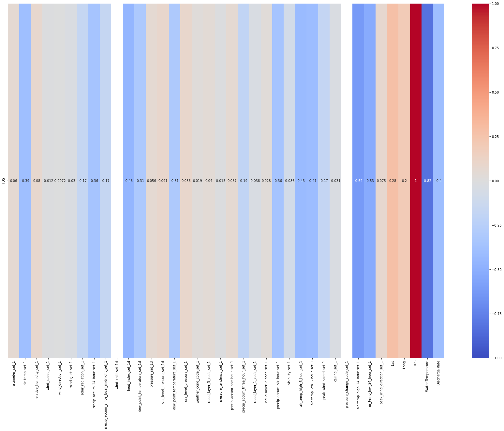
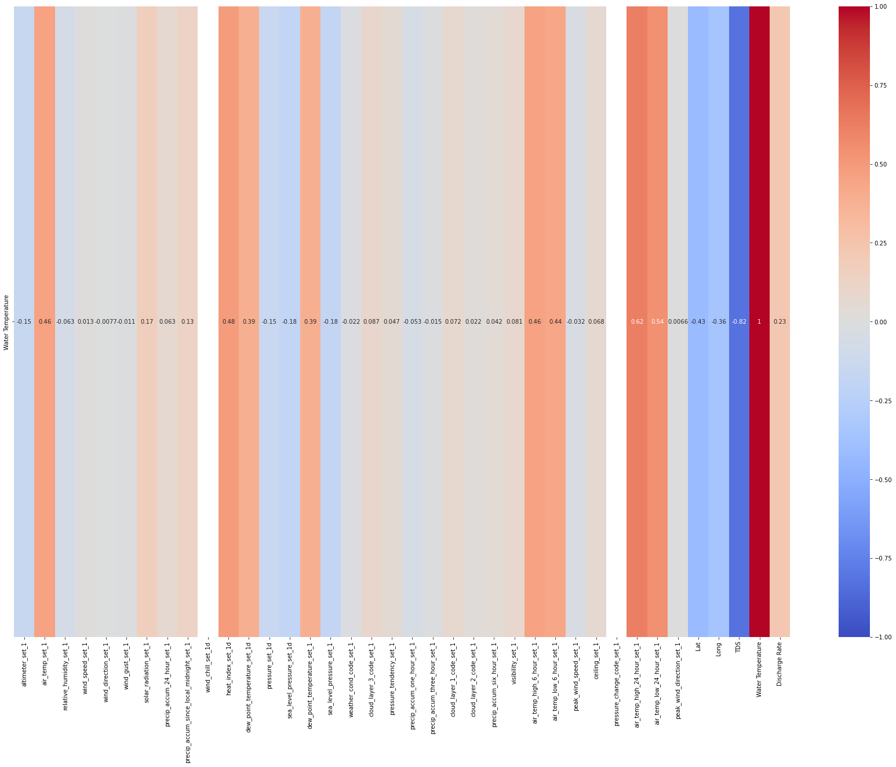

# SUBMISSION FORMAT FOR THE REPORTS

# Weather Data to Predict TDS, Water Temparture, and Water Quality

**Garrett DiPalma, Nilu Sah, Isaiah Gage**

## Project Summary

The Project is to predict given certain time, weather, and lat/lon values (or cluster) what is the predicted TDS(Total Dissolved Solids) and Water Temperature the lake.

## Problem Statement

The problem we are solving is if the TDS sensors, when it's turned back on, has issues, or futher down spring lake there are not that many markers however TDS and Water Temperature vary allot downstream. The idea is that if we have weather data, given certain location markers on the lake what is the predicted TDS and Water Temperature.

<Expand the section with few sentences for the _Project Progress_ assignment submission>
** Give a clear and complete statement of the problem.**: Predicting TDS and Water Temperature in Spring Lake Using Weather Data potential for issues with TDS sensors and the scarcity of location markers downstream.

** What is the benchmark you are using. Why? **: The benchmark we are using are R^2(R-Squared) and MSE(Mean Squared Error) which helps to evaluate regression model. While R-squared provides an overall measure of model goodness-of-fit, MSE provides a more detailed view of the magnitude of prediction errors. we are also going to use Common metrics like accuracy, precision, recall, F1 score, and mean average precision (mAP) serve as benchmarks to evaluate the effectiveness of models.

** Where does the data come from, what are its characteristics? Include informal success measures (e.g. accuracy on cross-validated data, without specifying ROC or precision/recall etc) that you planned to use.**: The TDS raw data which is a TDS sensor came from the physical device. we are also using the two weather datasets i.e. G3425 and KHYI as well as the data from San Marcos Airport. We are combining all these datasets together.

Characteristics for Dataset1 (Meteorological Data):

    Temporal Data: The Date_Time column indicates that this dataset is time-series data.
    Mixed Data Types: Includes numerical (continuous and discrete) and categorical data (like wind_cardinal_direction_set_1d).
    Weather and Climate Focus: Data is centered around weather and atmospheric conditions.

Characteristics for Dataset2 (Environmental Data):

    Geospatial and Temporal Data: Includes both location (latitude and longitude) and time (Taken At, Date) information.
    Environmental Focus: Concentrates on water quality parameters like TDS and temperature.
    Structured Time-Series Data: Data is organized in a time-series format with additional geospatial context.

Characteristics for Dataset3 (Extended Meteorological Data):  
 Characteristics:

    Comprehensive Meteorological Data: Provides a more detailed view of weather conditions compared to Dataset 1.
    High Granularity: Includes more specific and potentially high-frequency measurements (like one-hour precipitation accumulation).
    Aviation-Specific Data: Contains METAR data, useful for applications in aviation and detailed weather analysis.

Characteristics for Dataset4:

    Hydrological Focus: The dataset is centered around water-related measurements, particularly streamflow, which is a key parameter in hydrology and water resource management.
    High Temporal Resolution: The data is recorded at 15-minute intervals, providing a detailed time series of the measured parameter.
    Standardized Format: The use of agency codes, site numbers, and specific measurement codes suggests a standardized data collection protocol, likely for consistency across various sites and times.
    Quality Indicators: The presence of a quality code (141565_00060_cd) with each measurement suggests that the data includes metadata about its reliability or processing status.
    Time Zone Awareness: Including the time zone in which the data was recorded (tz_cd) is crucial for accurate temporal analysis, especially if integrating this data with other datasets collected in different time zones.

We used 10 fold cross-validation with randomforestregressor to significantly reduce overfitting.

** What do you hope to achieve?>**:
We are hoping to achieve to predict TDS value and water temperature based on weather temperature.

## Dataset

There are 4 datasets I'm using, two weather datasets (G3425 (4103 _ 17) and KHYI (114389 _ 43) Stations), a TDS dataset (36831 _ 9) and . There will need to be some extrapolation of the data to match it into one large dataframe. One, any missing data from G3425 needs to be filled in with KHYI data. The timestamps need to be from (06/11/22 - 06/11/23) for all datasets need to be 1 second intervals. Once the data is correctly aligned with the TDS data, they will be combined into one dataframe. Timestamp will be dropped. The Final_Dataset shape with extrapolation is (31536001 _ 67).

<Complete the following for the **Project Progress**>
** Description of the dataset (dimensions, names of variables with their description) If in doubt, use 3.1-3.3. [Datasheets For Datasets](https://arxiv.org/abs/1803.09010) as a guideline.**:

Dataset 1: Meteorological Data

Columns:

    Station_ID: Identifier for the weather station.
    Date_Time: Date and time of the observation.
    altimeter_set_1: Altimeter settings (in inches of mercury, INHG).
    air_temp_set_1: Air temperature (in Fahrenheit).
    relative_humidity_set_1: Relative humidity (in percentage).
    wind_speed_set_1: Wind speed (in miles per hour).
    wind_direction_set_1: Wind direction (in degrees).
    wind_gust_set_1: Wind gust (in miles per hour).
    solar_radiation_set_1: Solar radiation (in W/m²).
    precip_accum_24_hour_set_1: 24-hour precipitation accumulation (in inches).
    precip_accum_since_local_midnight_set_1: Precipitation accumulation since local midnight (in inches).
    wind_chill_set_1d: Wind chill (in Fahrenheit).
    wind_cardinal_direction_set_1d: Wind cardinal direction.
    heat_index_set_1d: Heat index (in Fahrenheit).
    dew_point_temperature_set_1d: Dew point temperature (in Fahrenheit).
    pressure_set_1d: Atmospheric pressure (in INHG).
    sea_level_pressure_set_1d: Sea level pressure (in INHG).

Dataset 2: Environmental Data

Columns:

    Lat: Latitude of the observation location.
    Long: Longitude of the observation location.
    TDS: Total Dissolved Solids (presumably in mg/L or similar unit).
    Temperature: Water temperature (presumably in Fahrenheit).
    Taken At: Date and time when the measurement was taken.
    Month, Day, Year: Date components of the Taken At field.
    Date: Date of the observation.

Dataset 3: Extended Meteorological Data

Columns:

    Similar to Dataset 1, but with additional fields like visibility_set_1, weather_cond_code_set_1, cloud_layer_3_code_set_1, precip_accum_one_hour_set_1, etc.
    Includes METAR data, which is a format for reporting weather information, primarily used in aviation.

Dataset 4:

Columns:

    agency_cd: Agency code, which in this case is 'USGS' for the United States Geological Survey.
    site_no: Site number, which identifies the specific location or station where the data was collected.
    datetime: The date and time of the observation.
    tz_cd: Time zone code, indicating the time zone for the datetime (e.g., CDT for Central Daylight Time).
    141565_00060: This appears to be a specific measurement or observation code. The number '00060' typically represents streamflow in cubic feet per second (cfs) in USGS datasets.
    141565_00060_cd: A code associated with the 141565_00060 measurement, often indicating the quality or status of the data (e.g., 'A' might stand for approved data).

Final Dimensions of dataset: (2102401, 48)

General Observations Across Datasets:

    High Dimensionality: All datasets have a wide range of variables, which might require dimensionality reduction techniques for analysis or modeling.
    Potential for Complex Relationships: Given the nature of weather and environmental data, there may be complex interactions between variables.
    Data Preprocessing Needs: The presence of different units (like Fahrenheit, INHG, etc.) and mixed data types suggests a need for careful preprocessing.

These datasets are rich in information and could support a variety of analyses or modeling tasks, particularly in the domains of meteorology, environmental science, and geospatial analysis.

**If you are using benchmarks, describe the data in details. If you are collecting data, describe why, how,**:

The benchmarks employed for assessing our models include R^2 (R-squared) and Mean Squared Error (MSE). In the context of our dataset, denoted as final\*df, and considering the implementation of both RandomForestRegressor and DecisionTreeRegressor, the following details characterize the data:

- 'TDS' and 'Water Temperature', are excluded from the list of features to prevent them from being used as predictors. These variables will be treated as the target variables for regression analysis.
- String columns in the dataset are encoded using the LabelEncoder. The dataset is divided into training and testing sets using the train_test_split function, with 70% of the data allocated to training and 30% to testing. This ensures a robust evaluation of the model's generalization performance.

RandomForestRegressor:
Performance Evaluation - MSE and R^2 Score:
Mean Squared Error (MSE) is computed for both 'TDS' and 'Water Temperature' on the test set. Additionally, R^2 Scores are calculated for both outputs. The MSE for 'TDS' is 5.696117261977822, and for 'Water Temperature' is 0.04212494134879333. The R^2 Score for 'TDS' is 0.9975356271504586, and for 'Water Temperature' is 0.9937009853989969.

DecisionTreeRegressor:
Before training the DecisionTreeRegressor, the numerical features are standardized using StandardScaler to ensure uniformity in scale.
Performance Evaluation - MSE and R^2 Score:
Mean Squared Error (MSE) is computed for both 'TDS' and 'Water Temperature' on the test set. R^2 Scores are also calculated for both outputs. The MSE for 'TDS' with the DecisionTreeRegressor is 15.169522521127822, and for 'Water Temperature' is 0.13272714302797894. The R^2 Score for 'TDS' is 0.993437045320132, and for 'Water Temperature' is 0.9801530830640167.

##Exploratory Data Analysis

<Complete for **Project Progress**>
For the Exploratory Data Analysis (EDA), the following graphs were used:

- **Heatmaps**: Utilized to visualize the correlation between 'TDS' (Total Dissolved Solids), 'Water Temperature', and other features in the dataset. This helps in identifying which features are most strongly related to our target variables.
- **Scatter Plots**: Employed to examine the relationships between 'TDS', 'Water Temperature', and other features. The goal was to identify the amount of noise in the dataset and to extrapolation is (31536001 \* 67).
- In analyzing the data represented in the graphs, a notable micro trend emerges when comparing Total Dissolved Solids (TDS) levels to precipitation and wind metrics. Specifically, there appears to be a negative correlation between TDS and both water temperature and precipitation. This suggests that as precipitation increases, or as water temperature rises, the concentration of dissolved solids in the water tends to decrease. This trend could be indicative of dilution effects, where increased rainfall or higher temperatures lead to greater water volumes, thereby diluting the concentration of dissolved substances. Similarly, the relationship with wind could be explained by increased surface agitation and aeration in windy conditions, potentially affecting the solubility or distribution of these solids.

The use of these graphs provided valuable insights into the underlying structure and relationships within the data, guiding subsequent preprocessing and modeling steps.

## Data Preprocessing

<Complete for _Project Progress_>
During the data preprocessing phase, the following steps were considered and implemented:

- **Standard Scaling**: After observing a significant amount of noise in the dataset through scatter plots, Standard Scaling was applied. This scaling method is particularly effective for regression models as it normalizes the features by removing the mean and scaling to unit variance, thus ensuring that all features contribute equally to the model's performance.
  - If yes, include steps here.
- **Dimensionality Reduction**: Although considered, dimensionality reduction techniques like PCA (Principal Component Analysis) were not used. This decision was based on the need to maintain interpretability of the features, as PCA transforms original variables into a set of linearly uncorrelated components which can be less interpretable. Moreover, the RandomForest model used in this project can inherently handle high-dimensional data effectively, reducing the need for explicit dimensionality reduction.

## Machine Learning Approaches

<Complete for **Project Progress**>

The machine learning approaches adopted in this project include:

- **Baseline Model - Decision Tree Regressor**: The Decision Tree Regressor was chosen as the baseline model. This choice was made because Decision Trees are simple to understand and interpret, and they provide a clear indication of feature importance. They serve as a good starting point before moving to more complex models.

- **Random Forest Regressor**: As the primary machine learning method, the Random Forest Regressor was selected. This choice was driven by its ability to handle non-linear data and its robustness against overfitting, which is particularly beneficial given the complexity and noise observed in the dataset. Random Forest falls under the family of ensemble methods, which are known for their improved accuracy and control over overfitting by combining multiple decision trees.

## Experiments

< **Project Progress** should include experiments you have completed thus far.>

- **Model Training and Evaluation**: Both the Decision Tree Regressor (baseline model) and the Random Forest Regressor were trained on the dataset. Their performance was evaluated using metrics such as Mean Squared Error (MSE) and R-squared (R²).

- **Hyperparameter Tuning**: For the Random Forest Regressor, hyperparameter tuning was performed using GridSearchCV to find the optimal set of parameters for the best model performance.

- **Feature Importance Analysis**: Post-training, an analysis of feature importance was conducted, especially for the Random Forest model, to identify which features contributed most to predicting 'TDS' and 'Water Temperature'.
